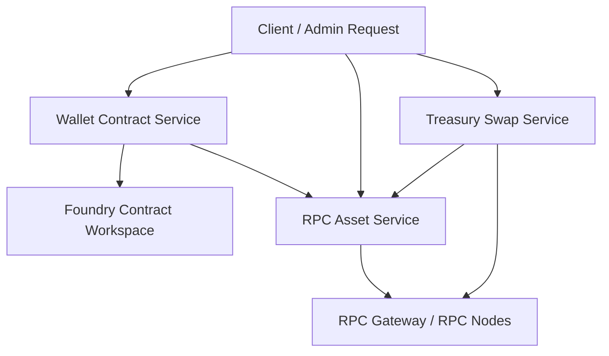

# Multi-Chain Wallet, Contract & Treasury Management System

## Overview

This project is a multi-chain backend platform for:

- wallet and sub-wallet management
- contract address management and deployment
- RPC node monitoring and failover
- wallet and contract asset monitoring
- automatic deposit and withdrawal
- automatic swap and unified transaction management

The current repository contains:

- a Foundry smart contract workspace
- PowerShell operational scripts
- an RPC gateway
- microservice scaffolding for the full system

## Business Modules

The full project is organized around these functional modules:

1. Wallet & Contract Management
2. RPC Node Monitoring
3. Asset Monitoring
4. Automatic Deposit & Withdrawal
5. Automatic Swap & Transaction Management

For a 3-member team, the recommended implementation split is:

- `wallet-contract-service`
- `rpc-asset-service`
- `treasury-swap-service`

## Recommended Service Architecture

### 1. Wallet Contract Service

Responsibilities:

- main wallet management
- sub-wallet management
- address generation
- secure private key handling
- contract registry
- automatic contract deployment
- deployment history

### 2. RPC Asset Service

Responsibilities:

- multi-chain RPC node registry
- connection management
- node health checking
- automatic node switching
- wallet and contract asset monitoring
- native balance collection
- token balance collection
- balance snapshots

### 3. Treasury Swap Service

Responsibilities:

- minimum balance rules
- automatic top-up
- automatic withdrawal and sweep
- swap execution through DEX
- unified transaction records
- retry handling for failed transactions

## High-Level Flow



## Supported Networks

- Ethereum Mainnet
- BNB Smart Chain
- OP Mainnet
- Base Mainnet

## Repository Structure

```text
project/
  services/
    wallet-contract-service/
    rpc-monitoring-service/
    asset-monitoring-service/
    treasury-automation-service/
    swap-transaction-service/

  gateway/
    server.mjs

  script/
    BaseScript.sol
    Deploy.s.sol
    ReadCounter.s.sol
    SetNumber.s.sol

  scripts/
    BaseRpc.ps1
    check-base-rpc.ps1
    check-chain-rpc.ps1
    deploy-sample.ps1
    load-env.ps1
    read-counter.ps1
    set-counter.ps1
    start-rpc-gateway.ps1
    verify-counter.ps1

  src/
    BaseRpcCounter.sol

  test/
    BaseRpcCounter.t.sol

  docs/
    backend-direct-flow.md
    microservice-architecture.md
    multi-chain-gateway.md
    progress-report-client.md
```

## Current Codebase Status

Implemented foundations already present in this repo:

- Foundry smart contract project
- contract deploy, read, write, and verify scripts
- multi-chain RPC selection
- RPC readiness checks
- optional RPC gateway with auth and rate limiting
- microservice structure and documentation scaffolding

Planned or partially scaffolded areas:

- wallet service runtime
- asset monitoring workers
- treasury automation workers
- DEX swap execution service
- unified transaction ledger service APIs

## Team Ownership

### Member 1

- Wallet & Contract Management

### Member 2

- RPC Node Monitoring
- Asset Monitoring

### Member 3

- Automatic Deposit & Withdrawal
- Automatic Swap & Transaction Management

## Technology Stack

- Solidity
- Foundry
- PowerShell
- Node.js
- JSON-RPC
- EVM-compatible chains

Recommended additions for the full platform:

- REST API framework
- database such as PostgreSQL
- Redis or job queue
- KMS or vault for signer security
- Docker Compose for local integration

## Environment Variables

Core RPC and gateway variables used in the current repo:

- `ETH_RPC_URL`
- `BNB_RPC_URL`
- `OP_RPC_URL`
- `BASE_RPC_URL`
- `ETH_CHAIN_ID`
- `BNB_CHAIN_ID`
- `OP_CHAIN_ID`
- `BASE_CHAIN_ID`
- `RPC_GATEWAY_BASE_URL`
- `GATEWAY_USERNAME`
- `GATEWAY_PASSWORD`
- `RPC_GATEWAY_PORT`
- `RATE_LIMIT_WINDOW_MS`
- `RATE_LIMIT_MAX`
- `PRIVATE_KEY`

Explorer verification variables:

- `ETHERSCAN_API_KEY`
- `BSCSCAN_API_KEY`
- `OP_ETHERSCAN_API_KEY`
- `BASESCAN_API_KEY`

## Quick Start

### 1. Prepare environment

```powershell
Copy-Item .env.example .env
.\scripts\load-env.ps1
```

### 2. Check RPC readiness

```powershell
.\scripts\check-base-rpc.ps1 -Network eth
.\scripts\check-base-rpc.ps1 -Network bnb
.\scripts\check-base-rpc.ps1 -Network op
.\scripts\check-base-rpc.ps1 -Network base
```

### 3. Build and test contracts

```powershell
forge build
forge test
```

### 4. Start gateway if needed

```powershell
.\scripts\start-rpc-gateway.ps1
```

### 5. Deploy sample contract

```powershell
.\scripts\deploy-sample.ps1 -Network eth
.\scripts\deploy-sample.ps1 -Network bnb
.\scripts\deploy-sample.ps1 -Network op
.\scripts\deploy-sample.ps1 -Network base
```

### 6. Read contract state

```powershell
.\scripts\read-counter.ps1 -Network op -Address 0xYourCounterAddress
```

### 7. Write contract state

```powershell
.\scripts\set-counter.ps1 -Network op -NewNumber 7
```

### 8. Verify contract source

```powershell
.\scripts\verify-counter.ps1 -Network eth -Address 0xYourCounterAddress
```

## Current Operational Flow

1. Load environment values
2. Select target chain
3. Resolve the correct RPC URL or gateway route
4. Check `eth_chainId`
5. Check `eth_syncing`
6. Execute deploy, read, write, or verify logic
7. Save contract deployment metadata

## Recommended Development Plan

### Phase 1

- finish Member 1 wallet and contract APIs
- finish Member 2 RPC monitoring and asset monitoring
- finish Member 3 transaction ledger base

### Phase 2

- integrate services
- add balance-triggered automation
- add swap flow and retry logic

### Phase 3

- add database migrations and production deployment
- add service authentication
- add monitoring, alerting, and dashboards

## Key Documents

- `docs/microservice-architecture.md`
- `docs/backend-direct-flow.md`
- `docs/multi-chain-gateway.md`
- `docs/progress-report-client.md`

## Goal

The goal of this project is to deliver one integrated multi-chain platform that can:

- manage wallets and contracts
- monitor RPC infrastructure
- track wallet and contract assets
- automate treasury operations
- execute swaps
- record all critical blockchain transactions in a consistent way
